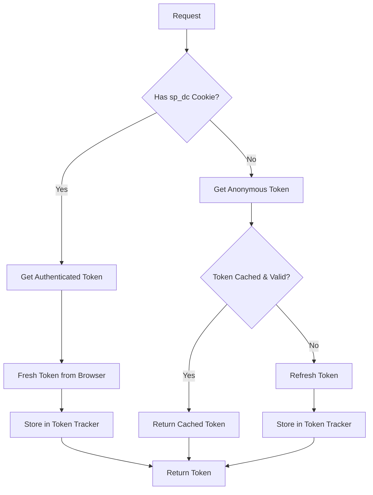

# Spotokn - Enhanced Spotify Token Service

A high-performance Spotify token service with real-time monitoring, enhanced error handling, and LavaSrc-inspired token tracking logic.

## 🚀 Features

- **Dual Token Support**: Anonymous and authenticated token handling
- **Proactive Refresh**: Automatic token refresh before expiration
- **Token Tracking**: LavaSrc-inspired token lifecycle management
- **Real-time Monitoring**: Comprehensive metrics and status endpoints
- **Docker Ready**: Production-ready containerization
- **Error Recovery**: Automatic service recovery and fallback mechanisms
- **Browser Automation**: Playwright-based token fetching
- **Web Interface**: Beautiful real-time dashboard

## 🔧 Recent Fixes & Improvements

### Dockerfile Enhancements
- ✅ Added non-root user for security
- ✅ Proper environment variable setup
- ✅ Health check integration
- ✅ Optimized layer caching with `--frozen-lockfile`
- ✅ Security hardening with read-only filesystem

### Package.json Alignment
- ✅ Added missing dependencies
- ✅ Aligned scripts with Dockerfile expectations
- ✅ Updated start command for production

### Spotify Token Logic Improvements
- ✅ Enhanced token validation with buffer time
- ✅ Improved fallback mechanisms
- ✅ Better error handling and recovery
- ✅ Proactive refresh with error recovery
- ✅ Token caching optimization

### Browser Service Fixes
- ✅ Fixed timeout handling
- ✅ Improved page cleanup
- ✅ Better error recovery
- ✅ Enhanced retry logic

### New Token Tracker (LavaSrc-inspired)
- ✅ Token lifecycle management
- ✅ Automatic refresh scheduling
- ✅ Token validation and cleanup
- ✅ Comprehensive statistics
- ✅ Memory-efficient storage

## 📋 API Endpoints

| Endpoint | Description |
|----------|-------------|
| `GET /api/token` | Get Spotify token (anonymous or authenticated) |
| `GET /api/token?debug=true` | Get debug information |
| `GET /api/token?metrics=true` | Get detailed metrics |
| `GET /api/token?force=true` | Force token refresh |
| `GET /api/status` | Get service status |
| `GET /api/metrics` | Get comprehensive metrics |
| `GET /api/token-tracker` | Get token tracker statistics |
| `GET /api/refresh` | Force refresh anonymous token |
| `GET /health` | Health check endpoint |
| `GET /` | Web interface dashboard |

## 🐳 Docker Deployment

### Quick Start
```bash
# Build and run with Docker Compose
docker-compose up --build

# Or build and run manually
docker build -t spotokn .
docker run -p 3012:3012 --env-file=.env spotokn
```

### Environment Variables
```bash
NODE_ENV=production
PORT=3012
HEADLESS=true
PROACTIVE_REFRESH_BUFFER=300000  # 5 minutes
CHECK_INTERVAL=60000             # 1 minute
MAX_RETRIES=3
RETRY_DELAY=2000
CACHE_TIMEOUT=3600000           # 1 hour
BROWSER_TIMEOUT=15000
BROWSER_RETRY_ATTEMPTS=3
BROWSER_RETRY_DELAY=2000
```

## 🚀 Usage Examples

### Anonymous Token
```bash
curl http://localhost:3012/api/token
```

### Authenticated Token
```bash
curl -H "Cookie: sp_dc=your_cookie_value" http://localhost:3012/api/token
```

### Force Refresh
```bash
curl http://localhost:3012/api/token?force=true
```

### Debug Information
```bash
curl http://localhost:3012/api/token?debug=true
```

### Metrics
```bash
curl http://localhost:3012/api/metrics
```

### Token Tracker Stats
```bash
curl http://localhost:3012/api/token-tracker
```

## 🏗️ Architecture

### Core Components

1. **Spotify Service** (`src/services/spotify.ts`)
   - Main token management service
   - Handles both anonymous and authenticated tokens
   - Proactive refresh scheduling
   - Error recovery mechanisms

2. **Token Tracker** (`src/services/token-tracker.ts`)
   - LavaSrc-inspired token lifecycle management
   - Automatic refresh scheduling
   - Token validation and cleanup
   - Memory-efficient storage

3. **Browser Service** (`src/services/browser.ts`)
   - Playwright-based automation
   - Request interception for performance
   - Cookie management
   - Error handling and retry logic

4. **Token Controller** (`src/controllers/token.ts`)
   - Request handling and validation
   - Response formatting
   - Error management
   - Metrics collection

5. **Web Interface** (`src/app.ts`)
   - Real-time dashboard
   - Service monitoring
   - API documentation
   - Health status display

### Token Flow



## 🔍 Monitoring & Debugging

### Web Dashboard
Access the real-time dashboard at `http://localhost:3012` for:
- Service status and health
- Memory usage and performance
- Token statistics
- Browser connection status
- Real-time metrics

### Logs
The service provides comprehensive logging:
- Request/response tracking
- Error details and stack traces
- Performance metrics
- Token lifecycle events

### Health Checks
- Docker health check: `curl -f http://localhost:3012/health`
- Service status: `curl http://localhost:3012/api/status`
- Detailed metrics: `curl http://localhost:3012/api/metrics`

## 🛠️ Development

### Prerequisites
- Bun >= 1.0.0
- Docker (for containerized deployment)
- Node.js 18+ (for development)

### Local Development
```bash
# Install dependencies
bun install

# Start development server
bun run dev

# Run tests
bun test

# Lint code
bun run lint

# Format code
bun run format
```

### Scripts
- `start`: Production server
- `dev`: Development server with watch mode
- `build`: Build for production
- `test`: Run tests
- `lint`: TypeScript linting
- `format`: Code formatting
- `docker:build`: Build Docker image
- `docker:run`: Run Docker container
- `docker:dev`: Docker Compose development
- `docker:prod`: Docker Compose production

## 🔒 Security Features

- Non-root user in Docker container
- Read-only filesystem
- Resource limits
- Security options
- Input validation
- Error sanitization

## 📊 Performance Optimizations

- Request interception to block unnecessary resources
- Token caching with intelligent refresh
- Memory-efficient token storage
- Proactive refresh scheduling
- Browser connection reuse
- Optimized Docker layers

## 🐛 Error Handling

- Comprehensive error recovery
- Automatic service restart
- Fallback token mechanisms
- Detailed error logging
- Graceful degradation
- Timeout management

## 📈 Metrics & Monitoring

- Request count and error rates
- Token refresh statistics
- Memory usage tracking
- Browser health monitoring
- Service uptime
- Token tracker statistics

## 🤝 Contributing

1. Fork the repository
2. Create a feature branch
3. Make your changes
4. Add tests if applicable
5. Submit a pull request

## 📄 License

MIT License - see LICENSE file for details

## 🙏 Acknowledgments

- Inspired by [LavaSrc](https://github.com/topi314/LavaSrc) token tracking logic
- Built with [Bun](https://bun.sh), [Elysia](https://elysiajs.com), and [Playwright](https://playwright.dev)
- Enhanced with comprehensive monitoring and error handling

---

**Version**: 2.0.0  
**Status**: Production Ready  
**Last Updated**: 2024